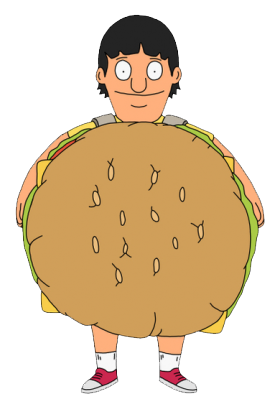

# Clicky Game
At a high level this is a web-app that allows users to play a simple memory game, just don't pick the same image twice!

At a more detailed level, this app is a full stack (frontend and backend) application that allows a user to select images, and the as long as the image selections do not repeat the user gets a higher score. Upon duplication of selections, the game ends and re-starts.

## Technologies used 

* React (JSX included)
* gh pages
* immutability helper

## Role in Development
All

## See it in action

[Click here!](https://xanderrrrrr.github.io/clickygame/)

